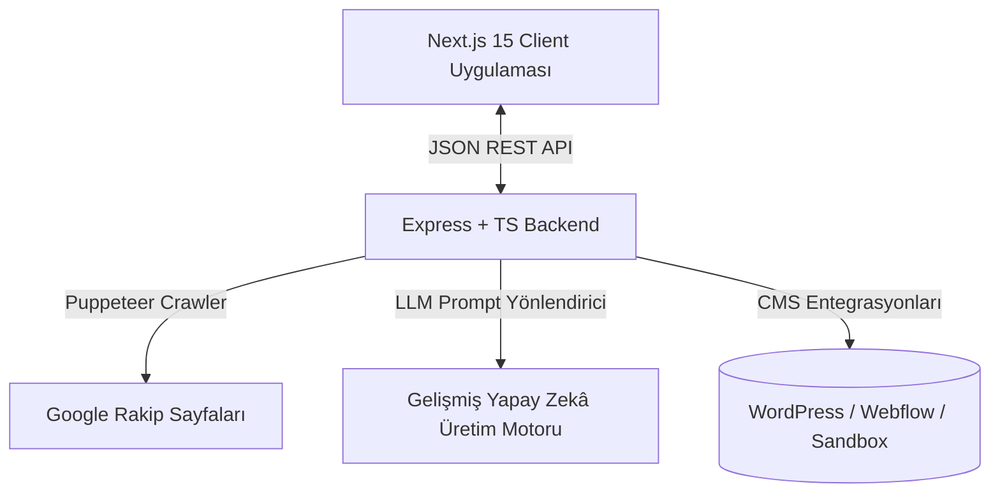

# 🚀 Agentic SEO & Content Autopilot (Yapay Zekâ Destekli SEO ve İçerik Otopilotu)

Rakip SERP analizini otomatikleştiren, anlamsal (semantik) taslak eşleştirmesi yapan ve gerçek zamanlı SEO doğrulaması ile otomatik CMS yayıncılığı sunan, yüksek performanslı ve profesyonel düzeyde bir **Yapay Zekâ Destekli Yazılım Mühendisliği** vitrinidir.

Bu platform; otomatik içerik pazarlama iş akışlarında sağlam bir **Sistem Düşüncesi** ve **Sürece İnsanı Dahil Eden (Human-in-the-Loop) Yönetim** yeteneğini gösteren, **tam işlevsel, yüksek kaliteli bir hızlı prototiptir (Proof of Concept - PoC)**.

---

## 🎨 Arayüz Tasarımı ve Kullanıcı Deneyimi

Kullanıcı arayüzü; netlik, okunabilirlik ve yüksek duyarlılık için optimize edilmiş, temiz ve son derece işlevsel bir açık mod (light-mode) tasarımına sahiptir:
- **Uyumlu HSL Renk Paletleri:** Standart renk şemalarından kaçınarak; yüksek okunabilirlik sağlamak amacıyla özenle seçilmiş yumuşak griler, zengin kömür tonlarında tipografi ve dengeli kontrast noktaları kullanır.
- **GPU Hızlandırmalı Mikro Animasyonlar:** Dinamik arayüz elemanları, akıcı ve gecikmesiz geçişler sunmak için donanım hızlandırmalı animasyonlardan (`translate3d`, `will-change`) yararlanır.
- **Özel Mühendislikle Geliştirilmiş Seçim Menüleri (Dropdowns):** Seçim bileşenlerinin gösterge paneli içeriklerinin üzerinde temiz bir şekilde konumlanmasını garanti etmek amacıyla dinamik z-index katmanlarına sahip React tabanlı özel menüler kullanarak tarayıcı yerel kontrollerini devre dışı bırakır.
- **Duyarlı Izgaralar (Responsive Grids):** Görsel hiyerarşiyi ve yapısal bütünlüğü tüm ekran boyutlarında korumak için esnek CSS Grid ve Flexbox katmanları kullanılarak tasarlanmıştır.

---

## 🛠️ Sistem Mimarisi

Uygulama, tamamen ayrık (decoupled) ve tip güvenli (type-safe) bir full-stack sistem olarak tasarlanmıştır:



### 1. Frontend İstemcisi (`frontend`)
- **Framework:** Next.js 15 (App Router) + TypeScript + Vanilla CSS.
- **Sayfa İçi SEO Skorlayıcı:** Başlıklar, kelime sayıları ve hedef anahtar kelime yoğunluğuna göre gerçek zamanlı olarak canlı SEO skoru (0-100) hesaplayan interaktif bir istemci tarafı motoru (SurferSEO/Yoast stili).
- **Etkileşimli Taslak Düzenleyici:** Kullanıcıların içerik yazımından önce yapısal başlıkları eklemesine, düzenlemesine, yeniden sıralamasına veya silmesine olanak tanıyan görsel, insan odaklı bir kontrol paneli.
- **Yardımcı Araçlar:** Ham HTML kodunu tek tıkla kopyalama veya doğrudan yerel `.html` dosyası olarak indirme araçları.

### 2. Backend Sunucusu (`backend`)
- **Çalışma Ortamı:** Node.js + TypeScript + Express.
- **Puppeteer Rakip Kazıyıcı (Scraper):** Google SERP sonuçlarını İngilizce dilinde (`&hl=en`) sorgulayan, sıralamadaki rakip URL'leri çıkaran ve bunların gövde taslaklarını ve başlık yapılarını derinlemesine kazıyan headless tarayıcı entegrasyonu.
- **İki Aşamalı Üretim Hattı:**
  1. **Taslak Eşleştirici:** Rakip başlık kalıplarını birleştirir, anahtar kelimeleri haritalandırır ve belirli semantik gereksinimleri hedefler.
  2. **Metin Yazarlığı Motoru:** Belirtilen tonlara (Profesyonel, Günlük, Akademik, Satış) uygun, kapsamlı ve intihal içermeyen HTML içerikler oluşturmak için gelişmiş yapay zeka modellerini kullanır ve Schema.org JSON-LD `FAQPage` yapılandırılmış veri işaretlemelerini enjekte eder.
- **Birleşik Yayınlama Servisi:** WordPress REST API, Webflow CMS v2 API ve yerel bir simülasyon Sandbox ortamı ile entegre çalışır.

---

## 🔍 İşe Alım Yöneticileri İçin Kod Navigasyon Rehberi

Kod tabanı, sorumlulukların net bir şekilde ayrılmasına ve sağlam hata sınırlarına odaklanarak, temiz mimari prensiplerine sıkı sıkıya bağlı olarak yapılandırılmıştır. Aşağıda, temel mühendislik yetkinliklerini gösteren kritik dosyalar listelenmiştir:

* **[scraperService.ts](backend/src/services/scraperService.ts):** Tarayıcı otomasyon becerilerini değerlendirir; rakip sayfalarını güvenli bir şekilde taramak ve temiz semantik başlık kalıplarını çıkarmak için headless Puppeteer örneklerini çalıştırır.
* **[geminiService.ts](backend/src/services/geminiService.ts):** Gelişmiş prompt mühendisliğini, prompt güvenlik kısıtlamalarını ve teknik SEO JSON-LD şema işaretlemesinin doğrudan yapılandırılmış HTML akışlarına otomatik enjeksiyonunu sergiler.
* **[publishService.ts](backend/src/services/publishService.ts):** WordPress/Webflow API istemcilerini ve tamamen çevrimdışı güvenli yerel simüle yayıncıyı uygulayarak harici CMS iletişimlerini yönetir.
* **[page.tsx](frontend/src/app/page.tsx):** Karmaşık React durum yönetimini (state management), gerçek zamanlı SEO skorlama algoritmasını, sürece insanı dahil eden interaktifliği ve birden fazla görsel aşama arasındaki durum senkronizasyonunu gösterir.
* **[globals.css](frontend/src/app/globals.css):** Yapısal CSS yerleşim uzmanlığını, tipografi kurallarını, özel tasarım açık mod estetiğini, özel değişken belirteçlerini ve donanım hızlandırmalı kullanıcı animasyonlarını sergiler.

---

## ⚡ Mühendislik Kalitesi ve En İyi Uygulamalar

Bu depo, yalnızca yapay zeka tarafından üretilen kodları sergilemek yerine, LLM sınırları etrafındaki titiz mühendisliği gösterir:

* **Sürece İnsanı Dahil Eden Doğrulama (Human-in-the-Loop):** Yapay zekanın en iyi insan rehberliği altında çalıştığını kabul eder. Anahtar kelimeden bitmiş makaleye körü körüne gitmek yerine, iş akışı şu adımları zorunlu kılar: **Rakipleri Analiz Et ➡️ Etkileşimli Taslak Düzenleyici (İnsan Müdahalesi) ➡️ Makaleyi Taslak Haline Getir ➡️ SEO Skorunu Doğrula ➡️ Yayınla**.
* **Sağlam Hata Yönetimi ve API Alternatifleri:** Çalışma zamanı çökmelerini önler. Üçüncü taraf API kotalarına ulaşıldığında veya şema sorguları başarısız olduğunda sistem; güvenli simüle edilmiş durumlara, mock API sandbox yayıncılığına ve yerel veri yükleyicilere geri döner.
* **Güvenlik ve Gizli Veri Hijyeni:** Proje, kesinlikle sıfır kimlik bilgisi sızıntısı standartlarını uygular. Yapılandırma yolları `.env` değişkenlerini kullanır ve şablonlar kodları gizli anahtarlardan net bir şekilde ayırır.
* **Dinamik Yığınlama Çözümleri:** Seçim menülerinin tüm gösterge paneli içeriklerinin üzerinde temiz bir şekilde görüntülenmesini garanti etmek için göreceli (relative) kapsayıcılar üzerinde durum güdümlü CSS katmanları uygular.

---

## 🚀 Başlangıç

### 📦 Gereksinimler
- **Node.js:** v18 veya daha yüksek sürüm
- **NPM:** Yerel olarak kurulu
- **Yapay Zekâ Kimlik Bilgileri:** Bir Google Gemini API Anahtarı

### 💻 Yerel Kurulum ve Çalıştırma

#### 1. Klonlayın ve Klasöre Gidin
```bash
git clone <depo-urlniz>
cd agentic-seo
```

#### 2. Backend Sunucusunu Başlatın
1. Backend dizinine gidin:
   ```bash
   cd backend
   ```
2. Çevre değişkenlerinizi oluşturun ve yapılandırın:
   ```bash
   cp .env.example .env
   # .env dosyası içerisine kendi GEMINI_API_KEY anahtarınızı ekleyin
   ```
3. Bağımlılıkları yükleyin ve sıcak yüklemeli (hot-reloading) geliştirme sunucusunu başlatın:
   ```bash
   npm install
   npm run dev
   ```
4. Sunucu yerel olarak şu adreste çalışır: **`http://localhost:5001`** (Sağlık durumu kontrolü `/api/health` adresinde mevcuttur).

#### 3. Frontend Gösterge Panelini Başlatın
1. Yeni bir terminal açın ve frontend dizinine gidin:
   ```bash
   cd frontend
   ```
2. İstemci bağımlılıklarını yükleyin ve Next.js geliştirme sunucusunu çalıştırın:
   ```bash
   npm install
   npm run dev
   ```
3. Tarayıcınızı açın ve şu adrese gidin: **`http://localhost:3000`**
